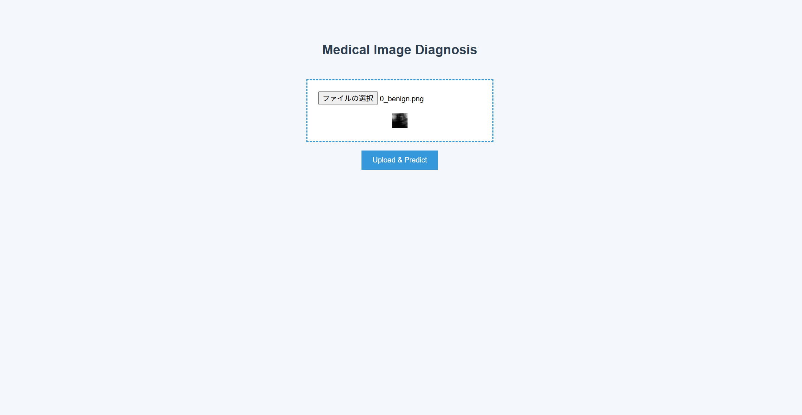
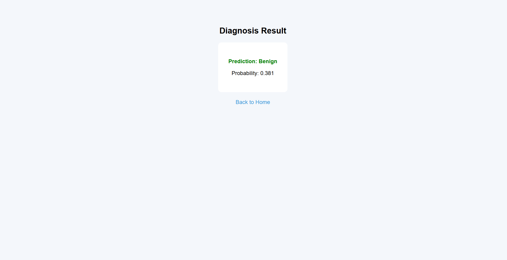

# Medical AI - Breast Cancer Classification App

## Overview
乳腺エコー画像を入力すると、良性（benign）または悪性（malignant）を分類するAIアプリです。  
CNNベースの画像分類モデルを用い、FastAPIで推論APIを構築し、Dockerで環境ごとパッケージ化しています。

---

## Motivation
医療AIアプリ開発の全体像（モデル構築〜API化〜コンテナ化）を理解することを目的として作成しました。  
データセットには、軽量で扱いやすいMedMNISTのBreastMNISTを使用しています。

---

## Demo
- 入力画像

- 入力画面

- 結果画面

---

## Tech Stack
- Python
- PyTorch
- FastAPI
- Docker

---

## Model
- CNNによる2値分類
- 入力：乳腺エコー画像
- 出力：良性 / 悪性
- 評価指標：AUC
- ベストモデルの保存先：outputs/best_model.pth
---

## Project Structure
project/
├── Dockerfile
├── README.md
├── config
├── demo_images
├── outputs
├── requirements.txt  # for development
├── requirements_docker.txt  # for docker
├── src
    ├── api
    ├── data
    ├── inference
    ├── models
    ├── templates
    └── training

---

## How to Run

### 0. git,Dockerのインストール
お使いのOS環境でGit,dockerをインストール

### 1. リポジトリのコピー
```bash
git clone https://github.com/katokatoo/medical-ai.git
cd medical_ai
```
### 2. Dockerで起動
```bash
docker build -t medical-ai .
docker run -p 8000:8000 medical-ai
```
### 3. ブラウザでアクセス
http://localhost:8000

---

## Usage
画像をアップロードすると、良性/悪性の予測結果と確率が表示されます。

---

## Future Work
・モデル精度の向上
・AWSへのデプロイ